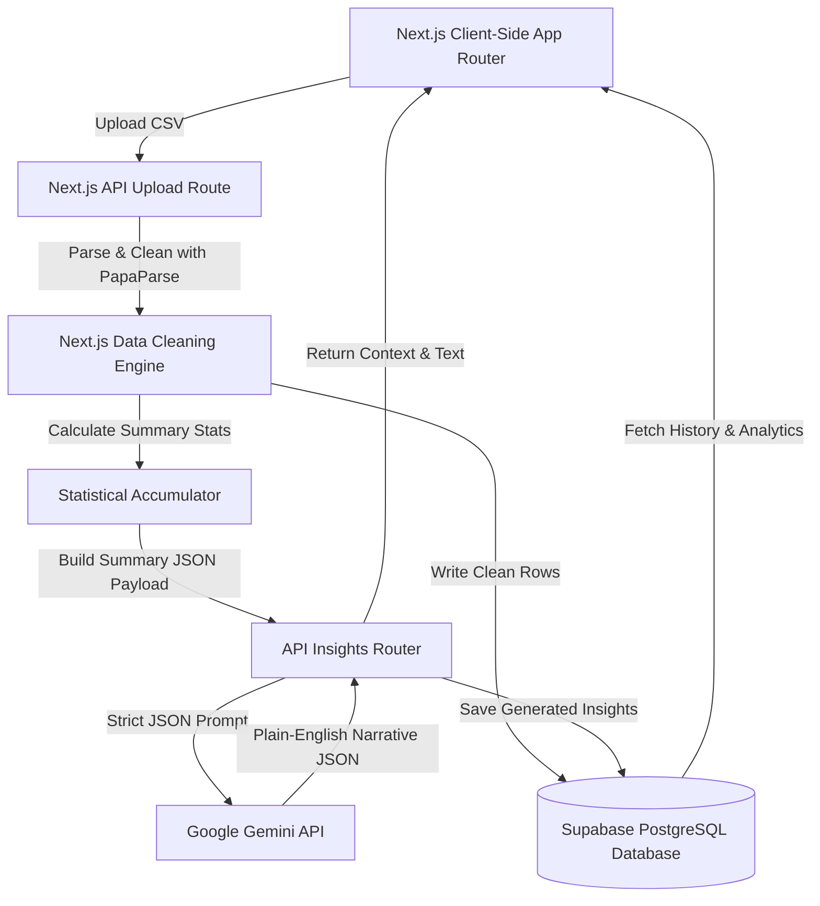
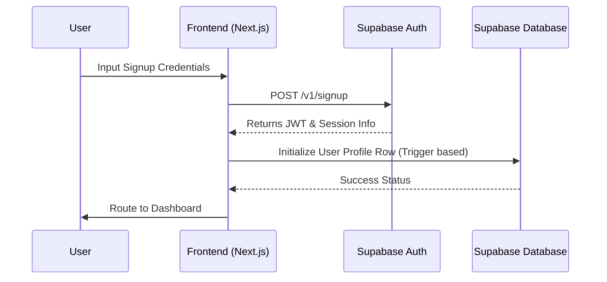
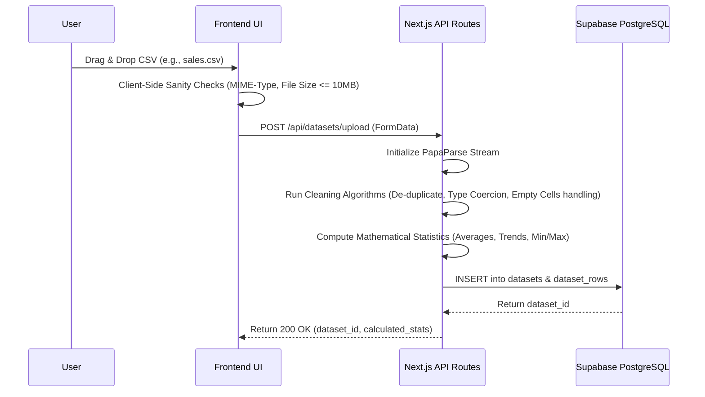
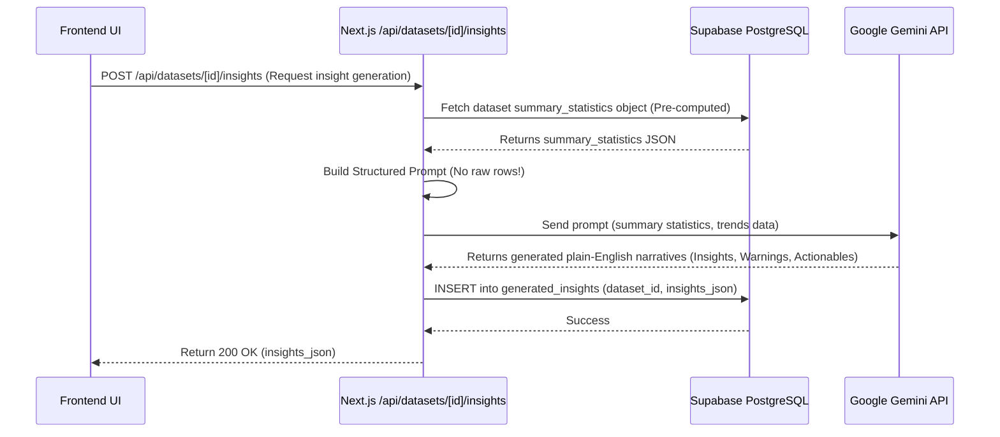
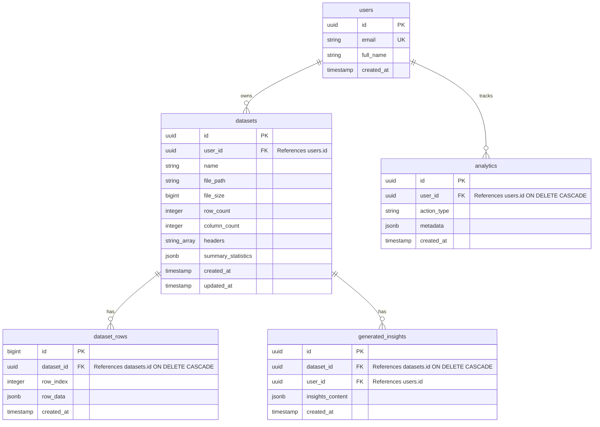
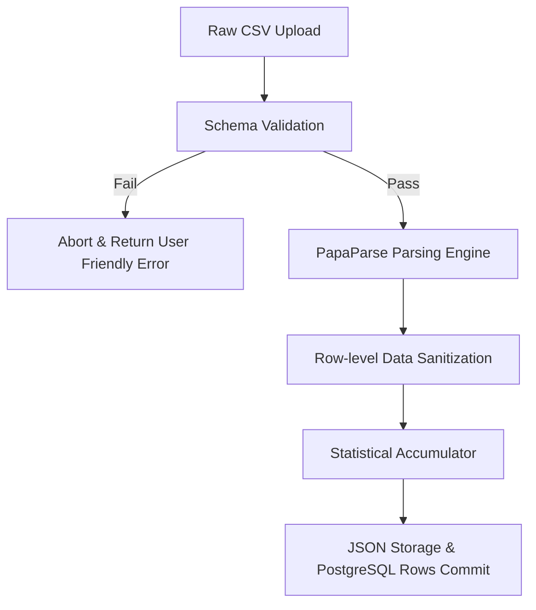
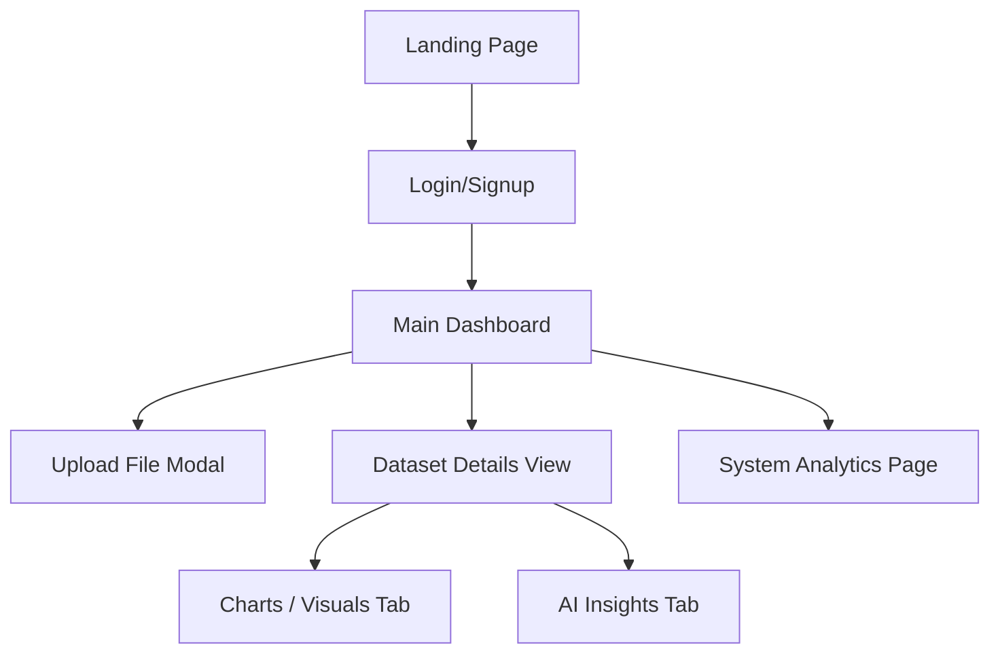
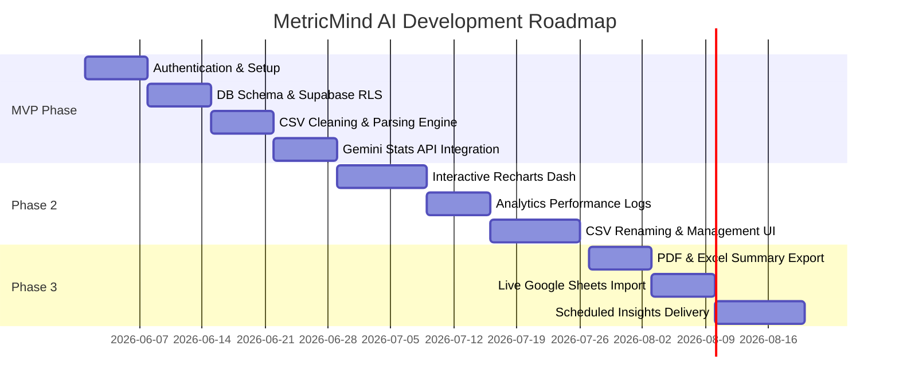

# Product Requirement Document (PRD)

## MetricMind AI
**Tagline:** *“An Analytics Dashboard That Explains Itself.”*
**Document Version:** 1.0.0  
**Authors:** Senior Product Manager, Senior Data Engineer, Senior AI Engineer, Senior Full Stack Architect, Technical Writer  
**Target Audience:** AI Coding Agents, Full Stack Engineers, Capstone Evaluators, Technical Stakeholders  

---

## Table of Contents
1. [Executive Summary & Product Vision](#1-executive-summary--product-vision)
2. [Problem Statement & Business Value](#2-problem-statement--business-value)
3. [User Personas](#3-user-personas)
4. [Functional Requirements (MVP & Core Features)](#4-functional-requirements)
5. [System Architecture & Core Flows](#5-system-architecture--core-flows)
6. [Database Design & RLS Policies](#6-database-design--rls-policies)
7. [API Route Specifications](#7-api-route-specifications)
8. [Data Processing Pipeline & CSV Handling](#8-data-processing-pipeline--csv-handling)
9. [AI Integration & Insight Layer](#9-ai-integration--insight-layer)
10. [User Interface & Component Guide](#10-user-interface--component-guide)
11. [Data Visualization & Charts Guidance](#11-data-visualization--charts-guidance)
12. [Security & Protection Mechanisms](#12-security--protection-mechanisms)
13. [Non-Functional Requirements](#13-non-functional-requirements)
14. [Edge Cases & Error Handling Matrix](#14-edge-cases--error-handling-matrix)
15. [Project Roadmap & Gantt Chart](#15-project-roadmap--gantt-chart)
16. [Key Performance Indicators (KPIs)](#16-key-performance-indicators-kpis)
17. [Project Folder Structure](#17-project-folder-structure)

---

## 1. Executive Summary & Product Vision

MetricMind AI is a modern, next-generation business intelligence SaaS platform designed to transform raw tabular data into immediate, comprehensible, plain-English narratives. While traditional dashboards present charts and statistics that require user interpretation, MetricMind AI automatically cleans datasets, calculates statistical benchmarks, creates interactive dashboards, and generates contextual explanations.

Our long-term product vision is to democratize business analytics, turning raw CSV uploads into interactive dynamic stories. Users no longer need to be data scientists to find trends; the dashboard literally explains what happened.

---

## 2. Problem Statement & Business Value

### The Problem
*   **The Interpretation Gap:** 

*   **Data Cleaning Friction:** Raw CSV files are rarely clean. They contain empty values, bad encoding, format issues, and mismatched headers. Most dashboard tools simply crash or output corrupted visualizations when encountering dirty data.
*   **Hallucination Risk in AI:** Sending raw, unsummarized CSV files to generic LLMs often leads to hallucinations, file size limit errors, high costs, and security risks (exposing raw customer info).

### The Business Value
*   **Time-to-Insight:** Reduces the time to go from raw file to insight from hours to under 15 seconds.
*   **Trustworthy AI:** By calculating statistics mathematically *first* on a secure backend and passing *only* aggregate numbers to Gemini, the platform guarantees that the AI cannot invent numbers or fabricate data trends.

---

## 3. User Personas

| Persona | Role / Profile | Pain Point | Core Need in MetricMind AI |
| :--- | :--- | :--- | :--- |
| **Sarah Jenkins** | Small Business Owner | Doesn't know how to write SQL or configure PowerBI, but needs to know which products sell best. | Uploads simple monthly sales CSV; receives clear recommendations on what to stock next. |
| **David Chen** | Digital Marketing Lead | Spends hours converting campaign metrics into summaries for executive presentations. | Uploads weekly performance CSV; copies the generated plain-English summary directly into slides. |
| **Elena Rostova** | University Researcher | Needs immediate confirmation of data distributions, clean headers, and summary statistics. | Uploads survey outputs; checks summary statistics cards and downloads cleaned data logs. |

---

## 4. Functional Requirements

### 4.1 Authentication & Profile
*   **Sign Up:** User can create a new account using Email, Password, and Full Name.
*   **Log In / Log Out:** Standard session management via Supabase Auth.
*   **Password Reset:** Generates a secure recovery link.
*   **Profile Management:** Access level controls, password changes, and account deletion.

### 4.2 CSV Upload & File Management
*   **File Uploader:** Drag-and-drop file component accepting files up to 10MB.
*   **Format Verification:** Validates that the file is structured with standard delimiters (comma, semicolon, tab) and has valid headers.
*   **File Storage:** Stores raw and cleaned files in Supabase Storage buckets, fully isolated by user directories.

### 4.3 Clean & Parse Engine
*   **Header Repair:** Replaces space characters with underscores, normalizes capitalization, and strips special characters.
*   **Data Cleaning:**
    *   Fills empty numerical cells with the mean/median of the column or zero (configurable).
    *   Removes duplicate rows.
    *   Coerces dates into standard ISO-8601 formatting.
*   **Row Parsing:** Converts raw strings into structured JSON rows stored inside the relational database.

### 4.4 Automated Chart Generation
*   **Data Typing:** Identifies numerical columns (for trends/averages) and categorical columns (for breakdown).
*   **Rendering:** Automatically maps columns to a Trend Line, Bar Chart, Pie Chart, and Area Chart based on data patterns.

### 4.5 Gemini-Powered Insight Generator
*   **Calculated Context:** Compiles statistics on averages, minimums, maximums, and percentage growth.
*   **Prompt Pipeline:** Packages these statistics into a clean prompt template sent to the Gemini API.
*   **Insight Outputs:** Displays plain-English text categorizing key insights, warnings, and recommendations.

### 4.6 Analytics Logging
*   **User Action Logs:** Tracks count of uploaded files, processed rows, visual page visits, and total generated insights.

---

## 5. System Architecture & Core Flows

MetricMind AI uses a decoupled client-server architecture built on Next.js 15, relying on Supabase for data management and security, and the Gemini API for intelligence.



### 5.1 Authentication Flow


### 5.2 CSV Upload and Data Processing Flow


### 5.3 AI Insight Generation Flow


---

## 6. Database Design & RLS Policies

MetricMind AI uses a relational database schema designed for high-performance retrieval and absolute tenant isolation via Supabase PostgreSQL Row Level Security (RLS).

### 6.1 Database Entity Relationship Diagram (ERD)


### 6.2 PostgreSQL Schema DDL Script
```sql
-- Create custom users profile table linked to Supabase Auth
CREATE TABLE public.users (
    id UUID REFERENCES auth.users(id) ON DELETE CASCADE PRIMARY KEY,
    email VARCHAR(255) UNIQUE NOT NULL,
    full_name VARCHAR(255),
    created_at TIMESTAMP WITH TIME ZONE DEFAULT TIMEZONE('utc'::text, NOW()) NOT NULL
);

-- Automate users row creation on new user signup in Supabase Auth
CREATE OR REPLACE FUNCTION public.handle_new_user()
RETURNS TRIGGER AS $$
BEGIN
    INSERT INTO public.users (id, email, full_name)
    VALUES (
        new.id,
        new.email,
        COALESCE(new.raw_user_meta_data->>'full_name', 'MetricMind User')
    );
    RETURN NEW;
END;
$$ LANGUAGE plpgsql SECURITY DEFINER;

CREATE OR REPLACE TRIGGER on_auth_user_created
    AFTER INSERT ON auth.users
    FOR EACH ROW EXECUTE FUNCTION public.handle_new_user();

-- Create datasets table
CREATE TABLE public.datasets (
    id UUID DEFAULT gen_random_uuid() PRIMARY KEY,
    user_id UUID REFERENCES public.users(id) ON DELETE CASCADE NOT NULL,
    name VARCHAR(255) NOT NULL,
    file_path TEXT NOT NULL,
    file_size BIGINT NOT NULL,
    row_count INTEGER NOT NULL,
    column_count INTEGER NOT NULL,
    headers TEXT[] NOT NULL,
    summary_statistics JSONB NOT NULL DEFAULT '{}'::jsonb,
    created_at TIMESTAMP WITH TIME ZONE DEFAULT TIMEZONE('utc'::text, NOW()) NOT NULL,
    updated_at TIMESTAMP WITH TIME ZONE DEFAULT TIMEZONE('utc'::text, NOW()) NOT NULL
);

-- Create dataset_rows table
CREATE TABLE public.dataset_rows (
    id BIGSERIAL PRIMARY KEY,
    dataset_id UUID REFERENCES public.datasets(id) ON DELETE CASCADE NOT NULL,
    row_index INTEGER NOT NULL,
    row_data JSONB NOT NULL,
    created_at TIMESTAMP WITH TIME ZONE DEFAULT TIMEZONE('utc'::text, NOW()) NOT NULL
);

-- Create generated_insights table
CREATE TABLE public.generated_insights (
    id UUID DEFAULT gen_random_uuid() PRIMARY KEY,
    dataset_id UUID REFERENCES public.datasets(id) ON DELETE CASCADE NOT NULL,
    user_id UUID REFERENCES public.users(id) ON DELETE CASCADE NOT NULL,
    insights_content JSONB NOT NULL,
    created_at TIMESTAMP WITH TIME ZONE DEFAULT TIMEZONE('utc'::text, NOW()) NOT NULL
);

-- Create analytics logs table
CREATE TABLE public.analytics (
    id UUID DEFAULT gen_random_uuid() PRIMARY KEY,
    user_id UUID REFERENCES public.users(id) ON DELETE CASCADE NOT NULL,
    action_type VARCHAR(100) NOT NULL,
    metadata JSONB NOT NULL DEFAULT '{}'::jsonb,
    created_at TIMESTAMP WITH TIME ZONE DEFAULT TIMEZONE('utc'::text, NOW()) NOT NULL
);

-- Database Optimization Indexes
CREATE INDEX idx_datasets_user ON public.datasets(user_id);
CREATE INDEX idx_dataset_rows_dataset ON public.dataset_rows(dataset_id);
CREATE INDEX idx_insights_dataset ON public.generated_insights(dataset_id);
CREATE INDEX idx_insights_user ON public.generated_insights(user_id);
CREATE INDEX idx_analytics_user ON public.analytics(user_id);
```

### 6.3 Supabase RLS Policies
```sql
-- Enable Row Level Security on all tables
ALTER TABLE public.users ENABLE ROW LEVEL SECURITY;
ALTER TABLE public.datasets ENABLE ROW LEVEL SECURITY;
ALTER TABLE public.dataset_rows ENABLE ROW LEVEL SECURITY;
ALTER TABLE public.generated_insights ENABLE ROW LEVEL SECURITY;
ALTER TABLE public.analytics ENABLE ROW LEVEL SECURITY;

-- 1. Users Policies
CREATE POLICY "Users can view their own profile information"
    ON public.users FOR SELECT
    USING (auth.uid() = id);

CREATE POLICY "Users can update their own profile information"
    ON public.users FOR UPDATE
    USING (auth.uid() = id);

-- 2. Datasets Policies
CREATE POLICY "Users can select their own datasets"
    ON public.datasets FOR SELECT
    USING (auth.uid() = user_id);

CREATE POLICY "Users can insert their own datasets"
    ON public.datasets FOR INSERT
    WITH CHECK (auth.uid() = user_id);

CREATE POLICY "Users can update their own datasets"
    ON public.datasets FOR UPDATE
    USING (auth.uid() = user_id);

CREATE POLICY "Users can delete their own datasets"
    ON public.datasets FOR DELETE
    USING (auth.uid() = user_id);

-- 3. Dataset Rows Policies
CREATE POLICY "Users can view rows of their own datasets"
    ON public.dataset_rows FOR SELECT
    USING (
        EXISTS (
            SELECT 1 FROM public.datasets
            WHERE public.datasets.id = public.dataset_rows.dataset_id
            AND public.datasets.user_id = auth.uid()
        )
    );

CREATE POLICY "Users can insert rows for their own datasets"
    ON public.dataset_rows FOR INSERT
    WITH CHECK (
        EXISTS (
            SELECT 1 FROM public.datasets
            WHERE public.datasets.id = public.dataset_rows.dataset_id
            AND public.datasets.user_id = auth.uid()
        )
    );

-- 4. Generated Insights Policies
CREATE POLICY "Users can select their own generated insights"
    ON public.generated_insights FOR SELECT
    USING (auth.uid() = user_id);

CREATE POLICY "Users can insert insights for their own datasets"
    ON public.generated_insights FOR INSERT
    WITH CHECK (auth.uid() = user_id);

CREATE POLICY "Users can delete their own insights"
    ON public.generated_insights FOR DELETE
    USING (auth.uid() = user_id);

-- 5. Analytics Policies
CREATE POLICY "Users can view their own analytics stats"
    ON public.analytics FOR SELECT
    USING (auth.uid() = user_id);

CREATE POLICY "System logging for analytics"
    ON public.analytics FOR INSERT
    WITH CHECK (auth.uid() = user_id);
```

---

## 7. API Route Specifications

All API routes follow Restful conventions. JWT verification is handled automatically on paths starting with `/api` using the Supabase Server Middleware.

### 7.1 CSV Upload: `POST /api/datasets/upload`
*   **Purpose:** Accepts standard multipart form-data CSV, cleans rows, computes statistics, and inserts record.
*   **Request Payload:**
    *   `multipart/form-data` containing key `file` (binary) and optionally `name` (string).
*   **Response Payload (201 Created):**
    ```json
    {
      "success": true,
      "message": "Dataset uploaded, cleaned, and processed successfully",
      "data": {
        "dataset_id": "8b51d8b7-817f-4428-a579-30dfeb55476a",
        "name": "sales_march_2026.csv",
        "row_count": 1420,
        "column_count": 5,
        "headers": ["date", "category", "region", "revenue", "units_sold"],
        "summary_statistics": {
          "total_revenue": 142000.50,
          "avg_revenue": 100.00,
          "growth_rate_pct": 18.2,
          "min_value": 15.00,
          "max_value": 1250.00,
          "top_category": "Electronics",
          "bottom_category": "Office Supplies"
        }
      }
    }
    ```
*   **Response Payload (400 Bad Request):**
    ```json
    {
      "success": false,
      "error": "Invalid file format. Only CSV files are supported.",
      "code": "INVALID_FILE_TYPE"
    }
    ```

### 7.2 List Datasets: `GET /api/datasets`
*   **Purpose:** Retrieves a high-level list of all datasets owned by the logged-in user.
*   **Response Payload (200 OK):**
    ```json
    {
      "success": true,
      "datasets": [
        {
          "id": "8b51d8b7-817f-4428-a579-30dfeb55476a",
          "name": "sales_march_2026.csv",
          "file_size": 248102,
          "row_count": 1420,
          "created_at": "2026-03-31T23:00:00Z"
        }
      ]
    }
    ```

### 7.3 Delete Dataset: `DELETE /api/datasets/[id]`
*   **Purpose:** Drops a dataset, cascading deletion to all rows, storage files, and generated insights.
*   **Response Payload (200 OK):**
    ```json
    {
      "success": true,
      "message": "Dataset deleted successfully"
    }
    ```

### 7.4 Rename Dataset: `PATCH /api/datasets/[id]`
*   **Purpose:** Renames a dataset.
*   **Request Payload:**
    ```json
    {
      "name": "Q1_Sales_Report_Final"
    }
    ```
*   **Response Payload (200 OK):**
    ```json
    {
      "success": true,
      "dataset": {
        "id": "8b51d8b7-817f-4428-a579-30dfeb55476a",
        "name": "Q1_Sales_Report_Final"
      }
    }
    ```

### 7.5 Get Dataset Details & Rows: `GET /api/datasets/[id]`
*   **Purpose:** Retrieves full metadata, pre-computed statistics, and sample clean rows for visualization.
*   **Response Payload (200 OK):**
    ```json
    {
      "success": true,
      "dataset": {
        "id": "8b51d8b7-817f-4428-a579-30dfeb55476a",
        "name": "sales_march_2026.csv",
        "headers": ["date", "category", "region", "revenue"],
        "summary_statistics": {
          "total_revenue": 142000.50,
          "avg_revenue": 100.00
        }
      },
      "sample_rows": [
        {"row_index": 1, "row_data": {"date": "2026-03-01", "category": "Electronics", "region": "South", "revenue": 1500.00}},
        {"row_index": 2, "row_data": {"date": "2026-03-02", "category": "Electronics", "region": "North", "revenue": 1200.00}}
      ]
    }
    ```

### 7.6 Generate AI Insights: `POST /api/datasets/[id]/insights`
*   **Purpose:** Executes safe prompt generation utilizing precalculated statistics and retrieves Gemini response.
*   **Response Payload (200 OK):**
    ```json
    {
      "success": true,
      "insights": {
        "id": "9c1a5d62-11ef-45fa-a9f8-55447788ffee",
        "dataset_id": "8b51d8b7-817f-4428-a579-30dfeb55476a",
        "insights_content": {
          "business_insights": "Sales increased 18.2% during March. This upward trajectory was highly powered by the South region, generating $1500.00 average order values.",
          "key_observations": [
            "Total revenue reached $142,000.50 with an average sales price of $100.00.",
            "Electronics remains the strongest performing category.",
            "Office Supplies registered as the bottom category with low sales volumes."
          ],
          "warnings": [
            "North region sales experienced a slight decline of 3.2% compared to early month statistics."
          ],
          "recommendations": [
            "Reallocate marketing funds from the North region to scale up operations in the high-performing South region.",
            "Review pricing structures of Office Supplies to clear stagnant inventory."
          ]
        },
        "created_at": "2026-06-17T23:12:00Z"
      }
    }
    ```

### 7.7 Get Usage Analytics: `GET /api/analytics`
*   **Purpose:** Fetches total user metrics for rendering the platform stats dashboard.
*   **Response Payload (200 OK):**
    ```json
    {
      "success": true,
      "metrics": {
        "total_uploads": 45,
        "avg_dataset_size_bytes": 1024500,
        "most_viewed_dataset_name": "sales_march_2026.csv",
        "insight_generation_count": 89
      }
    }
    ```

### 7.8 Get Dashboard Summary: `GET /api/dashboard/summary`
*   **Purpose:** Returns the aggregate cards statistics and recent activity items.
*   **Response Payload (200 OK):**
    ```json
    {
      "success": true,
      "summary": {
        "total_datasets": 12,
        "total_rows_monitored": 58200,
        "total_insights_generated": 24,
        "recent_uploads": [
          {
            "id": "8b51d8b7-817f-4428-a579-30dfeb55476a",
            "name": "sales_march_2026.csv",
            "created_at": "2026-06-17T23:11:30Z"
          }
        ]
      }
    }
    ```

---

## 8. Data Processing Pipeline & CSV Handling

To prevent errors, data processing is divided into strict procedural phases:



### 8.1 Schema Validation & Verification
*   **Extension & MIME-Type Check:** The system verifies the file name ends with `.csv` and has a `text/csv` or `application/vnd.ms-excel` MIME-type headers.
*   **Row-Limit Check:** Ensures count does not exceed 100,000 rows (for application stability in web environment).
*   **Encoding Normalization:** Decodes streams using UTF-8; handles UTF-8 BOM byte-order marks gracefully.

### 8.2 PapaParse Parsing Config
We parse the file in Next.js backend routes using `PapaParse` streaming API to minimize memory footprint:
```typescript
import Papa from 'papaparse';

// Parsing configuration options
const config = {
  header: true,             // Use first row as header keys
  skipEmptyLines: 'greedy', // Skip completely blank lines and commas
  dynamicTyping: true,      // Automatically coerce digits to Numbers
};
```

### 8.3 Data Cleaning Rules
1.  **Mismatched Columns:** If a row has fewer fields than the header array, pad it with `null`. If it has more fields, slice the extra values off.
2.  **Date Coercion:** Parse values in columns labeled `date`, `timestamp`, or `created_at` through ISO conversion. If invalid, keep original text or default to upload date.
3.  **Missing Numeric Values:** If a numeric parsing results in `NaN` or `null`, default to `0.00` or average value (depends on dashboard settings).
4.  **Header Sanitization:** Strip leading/trailing whitespaces, convert to lowercase, and replace spaces and punctuation with underscores (`_`). For example, `"Product Name!"` becomes `"product_name"`.

---

## 9. AI Integration & Insight Layer

> [!WARNING]
> **Zero Raw Data Transfer Policy:** Under no circumstances should individual raw rows, raw tabular datasets, or CSV database files be sent to the Gemini API. Exposing raw tabular data risks data privacy violations and model window saturation.

### 9.1 Summary Object Payload Structure
Instead of raw data, our data processing engine computes a statistical summary object. The following JSON payload is an example of what is safe to send to Gemini:

```json
{
  "dataset_metadata": {
    "name": "sales_march_2026.csv",
    "row_count": 1420,
    "headers": ["date", "category", "region", "revenue"]
  },
  "calculated_statistics": {
    "total_revenue": 142000.50,
    "avg_revenue": 100.00,
    "max_transaction": 1250.00,
    "min_transaction": 15.00
  },
  "growth_trends": {
    "growth_rate_pct": 18.2,
    "comparison_period": "Week 1 vs Week 4"
  },
  "categorical_distribution": {
    "top_category": { "name": "Electronics", "value": 85000.00 },
    "bottom_category": { "name": "Office Supplies", "value": 12000.00 }
  },
  "regional_distribution": {
    "south": 95000.50,
    "north": 47000.00
  }
}
```

### 9.2 Gemini System Prompt Design
The backend constructs a strict system prompt targeting the `gemini-2.5-flash` model, ensuring JSON output format:

```
You are a expert business analyst for MetricMind AI. 
Analyze the provided JSON statistical summary of a dataset and generate plain-English business insights.

RULES:
1. You must ONLY describe and explain the data provided. Never invent numbers, trends, or predictions not mathematically present in the parameters.
2. If region A is higher than region B, explain that difference. Do not invent marketing campaigns or reasons outside this data to explain it.
3. The response must be structured strictly in JSON. Do not return markdown block quotes around the JSON.

Expected Output Format:
{
  "business_insights": "A cohesive 2-3 sentence summary of the trends.",
  "key_observations": ["Observation 1", "Observation 2"],
  "warnings": ["Warning 1 if data shows declines or anomalies"],
  "recommendations": ["Recommendation 1 based on optimization of performance"]
}
```

---

## 10. User Interface & Component Guide

The application uses TailwindCSS styling combined with `shadcn/ui` components for unified design.



### 10.1 Landing Page
*   **Hero Section:** Visually rich heading: *"An Analytics Dashboard That Explains Itself."* Minimalist dynamic illustration of a dataset transforming into conversational text.
*   **Feature Grid:** Interactive grids showcasing CSV parsing, RLS database safety, dynamic Recharts visualizations, and Gemini AI insights.
*   **CTA Buttons:** *"Get Started for Free"* button leading to `/signup` and *"Watch Demo Video"* button.

### 10.2 Signup & Login Pages
*   **Visuals:** Centered container using glassmorphism effects (`backdrop-blur-md bg-white/10` or `bg-slate-900/50`).
*   **Inputs:** Validated email, password strength meters for signup, error prompts for invalid entries.
*   **Toggle:** Quick link to swap between login, signup, and forgot password triggers.

### 10.3 Dashboard Overview
*   **Key Performance Cards:**
    *   *Total Datasets:* Count metric with percentage growth indicator.
    *   *Clean Row count:* Cumulative parsed records counter.
    *   *Insight Queries:* Generated explanation count.
*   **Main Action Container:** Large interactive upload block with drag-and-drop animations.
*   **Uploads List:** Searchable table of previously uploaded CSV assets showing: Dataset Name, File Size, Created Date, and Action Dropdowns (Rename, View, Delete).

### 10.4 Upload Dataset Page / Modal
*   **Drag-and-Drop Dropzone:** Shows file type validation cues (green borders for `.csv`, red warning states for incorrect formats).
*   **Loading State:** Renders a progress progress bar while parsing: `Uploading...` -> `Sanitizing Headers...` -> `Calculating Statistics...` -> `Complete!`.

### 10.5 Dataset Details Page
*   **Tabbed Navigation:**
    *   *Tab 1: Data Viewer:* Interactive raw table showing the first 100 cleaned rows. Includes search capability.
    *   *Tab 2: Analytics Dashboard:* Renders dynamic charts configured automatically for the datasets columns.
    *   *Tab 3: AI Insights:* Split screen. Left shows core KPI cards; right features a dark-themed conversational window displaying Gemini observations, warnings, and recommendation blocks.

### 10.6 Platform Analytics Page
*   **System Util Cards:** Aggregated charts of upload frequencies, average sizes, and computation queues for audit tracking.

### 10.7 Profile Settings Page
*   **Inputs:** Full Name, Password Reset, API configuration toggles, and safety trigger to purge all user-associated dataset data.

### 10.8 404 Error Page
*   **Design:** Premium SVG graphic of a scattered bar chart.
*   **Text:** *"We calculated every option, but this page doesn't exist."*
*   **Action:** Large CTA button returning user back to `/dashboard`.

---

## 11. Data Visualization & Charts Guidance

MetricMind AI uses `Recharts` for interactive SVG visualizations. The system maps parsed variables to the ideal visual configuration automatically.

| Chart Type | Best Use Case | Rationale | Recharts Component |
| :--- | :--- | :--- | :--- |
| **Trend Line Chart** | Numeric metrics over dates (e.g., revenue by day) | Shows smooth, continuous change over time; simplifies visual trend observation. | `<LineChart>`, `<XAxis>`, `<YAxis>`, `<Tooltip>`, `<Line>` |
| **Bar Chart** | Categorical comparative variables (e.g., sales by product) | Clear visual hierarchy comparing sizes of discrete classes. | `<BarChart>`, `<Bar>`, `<Cell>` |
| **Pie Chart** | Contribution matrix (e.g., market share of a product segment) | Ideal to display parts of a whole (limited to max 6 categories for visual clean layout). | `<PieChart>`, `<Pie>`, `<Cell>` |
| **Area Chart** | Cumulative tracking volume over dates | Shows scale of numeric gains, indicating total growth trends. | `<AreaChart>`, `<Area>` |

### Responsive Rules
*   All charts are wrapped inside the `<ResponsiveContainer width="100%" height={400}>` class.
*   Tooltips are customized with glassmorphic styles matching the theme overlay.

---

## 12. Security & Protection Mechanisms

### 12.1 Row Level Security (RLS)
Supabase acts as the security boundary. PostgreSQL executes internal user validation triggers. No SQL query can select raw datasets, individual CSV rows, or insights belonging to a user ID that does not match the active session token (`auth.uid()`).

### 12.2 CSV Sanity and Input Validation
*   **Content Sanitization:** String inputs are parsed to remove Excel injection characters (e.g., preventing cells beginning with `=`, `+`, `-`, `@` from executing command sheets).
*   **Size Protection:** Restricts files to 10MB to prevent system buffer overruns.

### 12.3 Prompt Injection Prevention
The prompt engine does not allow user input to append to the system prompt. The template is pre-defined. Gemini receives calculated structural numbers, preventing user-submitted CSV fields from hijacking the AI commands.

### 12.4 Rate Limiting
API routes are restricted to a maximum of 5 dataset uploads per minute per user ID using memory caching or Vercel Edge rate limiters to prevent system abuse.

---

## 13. Non-Functional Requirements

### 13.1 Performance
*   **Upload-to-Render Time:** Processing, parsing, and storing a 5MB CSV with up to 50,000 rows must execute within 5 seconds.
*   **Insight Generation:** Gemini AI analysis output must return in less than 3 seconds after statistical aggregation.
*   **Dashboard Page Load:** Dashboard initial load under 1.5 seconds.

### 13.2 Scalability
*   **Serverless APIs:** Next.js routes are deployed to Vercel Serverless/Edge to scale concurrently with traffic increases.
*   **Database Scaling:** Supabase Postgres manages connections and executes read-replicas for read queries if analytics volume expands.

### 13.3 Availability & Reliability
*   **Service Availability:** Targeting 99.9% uptime for core API and storage layers.
*   **API Offline Failover:** Graceful network connection checks: warn user if internet drops, cache dashboard metrics locally.

### 13.4 Accessibility
*   **Standard Compliance:** WCAG 2.1 AA compliant. Text contrast ratios are kept at 4.5:1 minimum, with semantic markup and complete ARIA attributes.

---

## 14. Edge Cases & Error Handling Matrix

| Scenario | System Impact | Graceful Fallback Action | User Notification |
| :--- | :--- | :--- | :--- |
| **Empty CSV File** | Cleaning engine has no inputs to run parsing. | Abort ingestion, reject database insert. | *“The uploaded file contains no rows. Please verify your dataset and try again.”* |
| **Missing Primary Headers** | Calculations fail because columns are unnamed. | Generate index names (e.g., `column_1`, `column_2`). | *“Headers were missing. We named them generic columns so you can still visualize the data.”* |
| **Duplicate Columns** | Causes duplicate JSON dictionary keys. | Suffix duplicates automatically (e.g., `revenue`, `revenue_1`). | Silent resolution. System updates names internally. |
| **Invalid Number Formatting** | Math metrics return NaN. | Strips non-digit chars (e.g., `$1,200.50` -> `1200.50`). | Silent resolution. Standardizes numbers. |
| **Gemini API Outage** | Dashboard renders charts but cannot output written text. | Fallback to basic template: show calculated stats in a structured list. | *“AI analysis is currently unavailable, but your charts and raw data statistics are fully computed below.”* |
| **Network Interruption** | API transmission breaks. | Retries dataset upload twice with exponential backoff. | *“Network connection lost. Attempting to reconnect...”* |

---

## 15. Project Roadmap & Gantt Chart

The development roadmap is structured into 3 distinct operational phases over a 12-week schedule.



---

## 16. Key Performance Indicators (KPIs)

*   **User Registration Growth:** Target 15% week-over-week increase.
*   **Average CSV Process Time:** Target < 4 seconds for files under 5MB.
*   **AI Insight Accuracy Score:** Target > 98% user satisfaction (measured by simple thumbs up/down tooltips on generated insights).
*   **User Retention Index:** Weekly active users/total signups ratio > 40%.
*   **Dashboard Speed Index:** Lighthouse performance scores > 90/100 on desktop environments.

---

## 17. Project Folder Structure

MetricMind AI uses the Next.js 15 App Router directory structure:

```
├── app/
│   ├── layout.tsx             # Main App shell configuration
│   ├── page.tsx               # Landing Page Component
│   ├── login/
│   │   └── page.tsx           # Login Screen Page
│   ├── signup/
│   │   └── page.tsx           # Signup Screen Page
│   ├── dashboard/
│   │   ├── page.tsx           # Main User Dashboard Landing
│   │   └── layout.tsx         # Dashboard specific headers/sidebar
│   ├── datasets/
│   │   ├── [id]/
│   │   │   ├── page.tsx       # Dataset Details Dashboard
│   │   │   └── insights/
│   │   │       └── page.tsx   # Detailed AI Insights view
│   │   └── upload/
│   │       └── page.tsx       # Dedicated Drag-and-Drop Uploader
│   ├── analytics/
│   │   └── page.tsx           # Platform Usage Analytics
│   └── settings/
│       └── page.tsx           # User settings & Profile controls
├── components/
│   ├── ui/                    # shadcn/ui shared components
│   │   ├── button.tsx
│   │   ├── card.tsx
│   │   ├── table.tsx
│   │   └── dialog.tsx
│   ├── charts/                # Recharts customized wraps
│   │   ├── LineChart.tsx
│   │   ├── BarChart.tsx
│   │   ├── PieChart.tsx
│   │   └── AreaChart.tsx
│   ├── FileUpload.tsx         # Custom drag-and-drop handler
│   └── SidebarNav.tsx         # Left-side navigation bar
├── lib/
│   ├── supabase.ts            # Client initializer for Supabase
│   ├── gemini.ts              # Gemini API Client & Prompt Wrapper
│   └── cleanEngine.ts         # PapaParse & Data cleaning functions
├── hooks/
│   └── useAuth.ts             # Auth session monitoring hook
├── types/
│   └── index.ts               # Global TypeScript definitions
├── services/
│   └── api.ts                 # Frontend API helper scripts
├── utils/
│   └── formatters.ts          # Currency, Numbers, and Date string formatters
├── public/
│   └── assets/                # Statics (Icons, logo patterns, background graphics)
├── styles/
│   └── globals.css            # Tailwind directives & theme configuration
├── package.json
└── tailwind.config.ts
```
